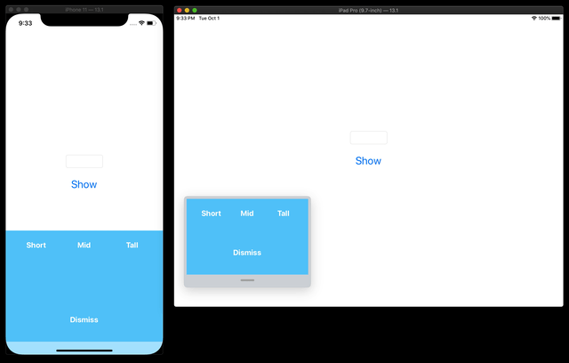

# Bureau - A Container to display your customized view on UIKit's InputView

An easy way to display a custom view on the input view in UIKit.

**Importantly to supports floating keyboard on iPadOS**



## Requirements

- Swift 5.1
- iOS 10 +

## Usage

```swift

class ViewController: UIViewController {

  // 💡 Step.1 Put BureauController
  private let bureauController = BureauController()

  override func viewDidLoad() {
    super.viewDidLoad()

    // 💡 Step.2 Set the viewController as an owner.
    bureauController.setOwner(viewController: self)

    // 💡 Step.3 Create an instance of your custom input view.
    let yourCustomInputView = ...

    // 💡 Step.4 To display your input view, do followings.
    bureauController.containerView.addSubviewToEdges(view: yourCustomInputView)

    // 💡 Step.5 Finally, Let's try to show it.
    bureauController.show()

  }
}
```

## Installations

Currently, supports only CocoaPods.

In Podfile, please put the following.

```ruby
pod 'Bureau'
```

## Author

Hiroshi Kimura<Muukii>

## LICENSE

MIT
